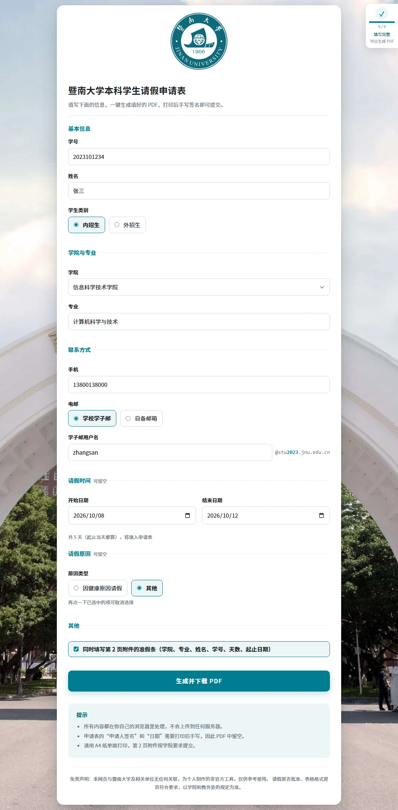
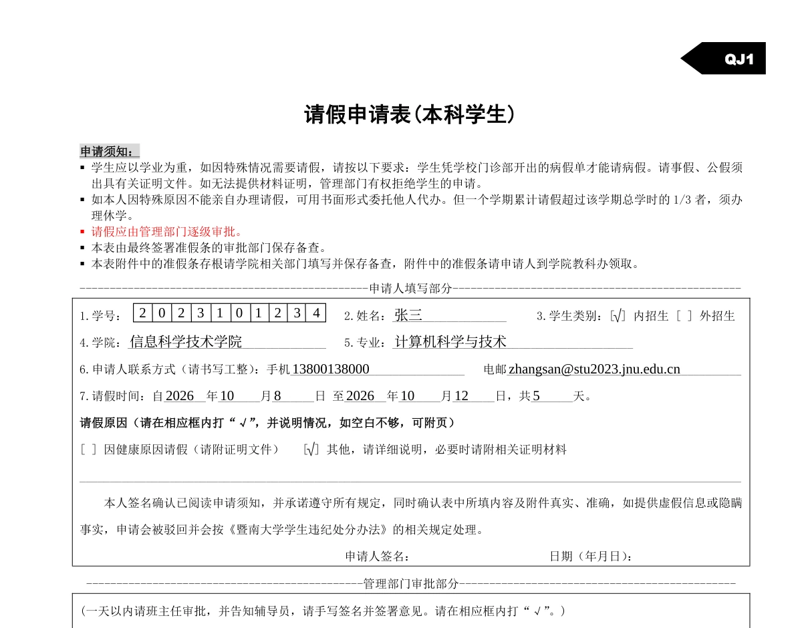

# 暨南大学本科学生请假申请表 · 一键生成

给暨南大学本科学生用的网页小工具：填好信息，一键下载填好的《暨南大学学生请假申请表》PDF，
打印后手写签名即可提交。**纯前端**，没有后端，生成过程全在浏览器内存里完成，不上传任何数据。

在线版：<https://pages.wtp016.eu.org/>



生成结果（申请表第 1 页的申请人填写部分）：



## 功能要点

- 学院选择面板可按关键词搜索（43 个学院，含医学部其他临床医学院）
- 学子邮只需填用户名，域名按学号前 4 位自动拼：`zhangsan` + `2025103491` → `zhangsan@stu2025.jnu.edu.cn`
- 学号逐格填入申请表的 10 个方格，类别与原因自动打勾，天数按起止日期算
- **请假时间与请假原因可以留空**，PDF 里那两行留白（纸质表格上也能手写）；
  请假时间「要么整项留空、要么填对」，只填一半或填反都会拦住生成
- 生成前有预览，确认无误才下载

## 运行

整个仓库就是静态站点，没有构建步骤、不用装依赖。**必须走 http(s)** —— 页面用 `fetch`
读字体，`file://` 下会被浏览器拦掉：

```bash
python -m http.server 8080     # 或 npm run serve
# 打开 http://localhost:8080/
```

部署：GitHub Pages → Settings → Pages → Source 选 `main` 分支根目录。

首次加载约 3.0 MB（思源黑体常用字包 1.5 MB + 背景图 0.8 MB + JS 等）。另有几份按需下载、
不在首屏里：姓名里有生僻字时才会下生僻字包（约 5 MB）；点「生成」时下 PDF 用的宋体
（约 7.7 MB，覆盖 CJK 基本区 + 扩展 A 区全部码位，所以生僻字也能画进 PDF）。

## 项目结构

```
index.html              页面
style.css               样式
js/app.js               表单交互、校验、预览与下载
js/fill-pdf.js          把数据画到模板上（浏览器和 Node 共用）
js/pdf-slots.js         模板中各填写位置的坐标（实测得到）
js/template-data.js     模板 PDF 的 base64            ← 由脚本生成
js/font-coverage.js     字体覆盖的码位表              ← 由脚本生成
assets/template.pdf     请假申请表模板（学校原件）
assets/background.jpg   页面背景图（校园牌坊，4000×2219 JPEG）
assets/fonts/           裁剪后的开源字体（黑体供网页，宋体与 Tinos 供 PDF）
vendor/                 第三方库，见 vendor/PATCHES.md
tools/                  开发脚本，不参与页面运行
```

## 开发

需要 Python 3 与 Node.js。

```bash
pip install fonttools brotli pypdf

node tools/verify.mjs                      # 生成 build/*.pdf 样例
python tools/check-output.py build/*.pdf   # 检查内嵌字体有没有缺字（字体损坏的回归）

python tools/prepare-fonts.py              # 重新裁剪字体（黑体从 CERNET 镜像取，比 GitHub 快两个数量级）
node tools/embed-template.mjs              # 换了 assets/template.pdf 之后重新内嵌
```

仓库没有单元测试，回归就靠上面两条命令。`verify.mjs` 的四个用例各有分工，改了生成逻辑都要看：
`sample` 普通情况、`stress` 大量不同汉字、`long` 超长文本、`blank` 请假时间与原因全空。

## 发布前必做：递增版本号

GitHub Pages 对 css / js / 图片缓存 **4 小时**，HTML 只缓存 10 分钟。不加版本号会出现
「新 HTML + 旧资源」的错位。**改了哪个资源，就递增引用它的那一处**：

```bash
grep -rn "v=[0-9]\{8\}" index.html style.css     # 看现在有哪些字面量
```

容易漏的是连带关系：`style.css` 的内容改了，`index.html` 里的 `style.css?v=` 必须一起递增，
否则访客拿到的是缓存里的整份旧样式；换背景图同理。

字体分两条路：生成 PDF 用的宋体与 Tinos 跟着 `js/app.js` 的版本号走（`app.js` 从自身 URL
取版本号拼字体地址），不用单独维护；网页显示用的黑体写在生成的 `assets/fonts/faces.css` 里，
版本号是 `tools/prepare-fonts.py` 顶部的 `FONT_VERSION` —— 重新裁剪字体后要递增它。

## 几处「为什么这么写」

- **填写坐标是实测的。** `js/pdf-slots.js` 里每条横线的起止 x、基线 y 取自模板 PDF 内容流中
  字符的精确坐标，不是照截图量的像素 —— 换模板要重新测，别用估算值。
- **模板以 base64 内嵌**（`js/template-data.js`），而不是去 `fetch` 那个 PDF：部分浏览器的
  安全软件会按文件内容识别 PDF 并掐断响应，`fetch` 报 NetworkError，改文件名换后缀都没用。
- **`vendor/fontkit.es.min.js` 带着两处补丁**，其中「loca 始终写长格式」不能丢，否则生成的
  PDF 会随机缺字。见 [vendor/PATCHES.md](vendor/PATCHES.md)。
- **只用开源字体。** 学校模板原本的宋体与 Times New Roman 随 Windows 分发，不能进公开仓库；
  现用思源黑体（网页）、思源宋体 + Tinos（PDF），四份都是 SIL OFL 1.1，
  许可见 [assets/fonts/LICENSE.md](assets/fonts/LICENSE.md)。

## 已知限制

- 字体覆盖 GB2312 全部汉字（7547 个）。生僻字（如「燚」「㸚」）会被拦下并提示替换，
  不会生成缺字的 PDF。
- 学号、手机号只校验格式，不校验真实性。
- 页面底部预留了大陆备案号的位置（`index.html` 的 `.icp`，默认 `hidden`）。GitHub Pages
  属境外托管无法备案，真要备案得先把站点迁到境内主机。
- PDF 字体覆盖 CJK 基本区与扩展 A 区，再往外的扩展 B 区（U+20000 起，如「𠮷」）不在范围内，
  遇到会被拦下并提示替换。

## 许可证

代码以 [GPL-3.0](LICENSE) 发布，衍生作品需同样开源。

第三方组件：[pdf-lib](https://github.com/Hopding/pdf-lib) 1.17.1、
[@pdf-lib/fontkit](https://github.com/Hopding/fontkit) 1.1.1、
[pako](https://github.com/nodeca/pako) 2.1.0（均 MIT）；思源黑体 / 思源宋体 / Tinos
（均 SIL OFL 1.1）。`assets/template.pdf` 是学校发布的表格原件，其中的文字与字体属于原文档。

本项目为非官方工具，与暨南大学及其任何部门无关；请假是否批准、表格格式是否符合要求，
以学院和教务处的规定为准。
