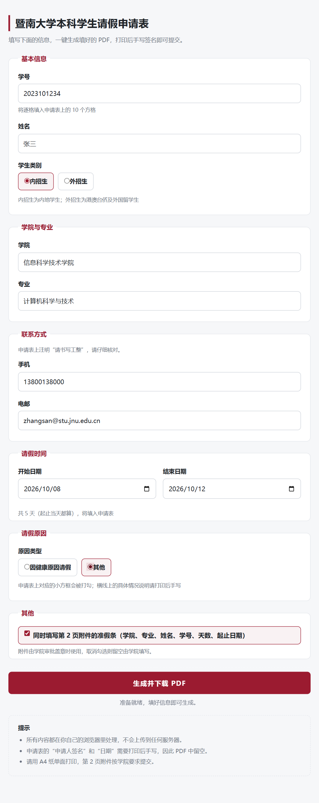
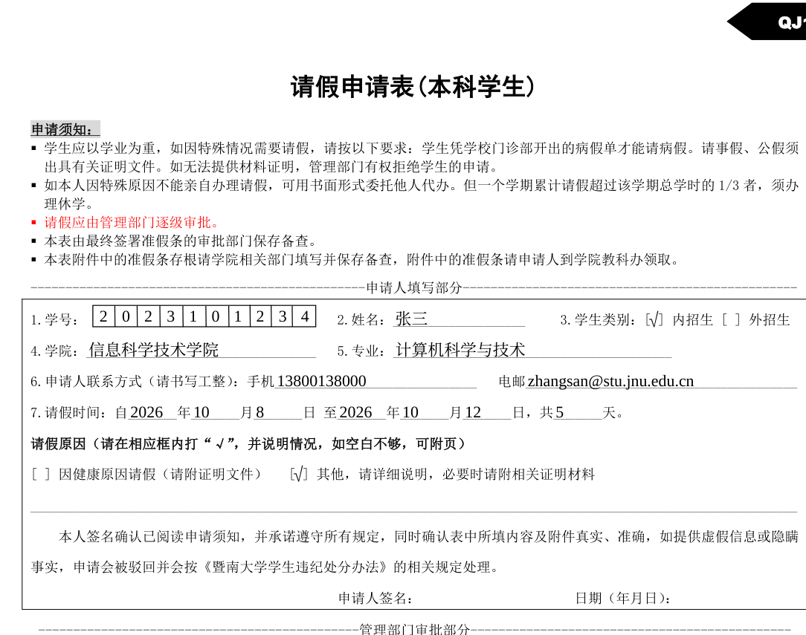

# 暨南大学本科学生请假申请表 · 一键生成

给暨南大学本科学生用的网页小工具：填好信息，一键下载填写完毕的《暨南大学学生请假申请表》PDF，
打印后手写签名即可提交。纯前端实现，全部在你自己的浏览器里完成，不联网上传任何数据。

> 在线版：<https://pages.wtp016.eu.org/>

## 预览

填写界面：



生成结果（申请表第 1 页的申请人填写部分）：



## 功能

- 打开时先露出校园牌坊的背景与校徽、标题（收起状态下只显示这些，表单不会露出），
  点“点击展开填写”按钮后，填写面板升到顶部铺满屏幕，之后滚动都发生在面板内部，页面本身不再滚动。
  展开是单向的：这一步之后“点击展开填写”按钮就不再出现，顶部从校徽开始，
  滑动、方向上键都不会把面板收回初始状态
- 白色卡片本身就是滚动容器：上下边缘在滚动过程中固定不动，四角始终是圆角，
  并与网页上下边缘保持 14px 间距（内容在卡片内部滚动、被卡片边缘裁切）
- 填写学号、姓名、学生类别、学院、专业、手机、电邮、请假时间、请假原因类型
- 学院点击后弹出选择面板，面板里可按关键词搜索（如输入“法学”“临床”）；名单共 43 个，
  以暨南大学官网“院系设置”为基础并含医学部其他临床医学院，两个名称合办的院系
  （如法学院/知识产权学院）拆成两条分别列出，只列学院、不列研究机构；
  名单里没有的学院可选面板最后的“其他（手动填写）”
- **请假时间与请假原因可以先空着**，其余各项填好就能生成，PDF 里那两行留白（纸质表格上
  这两处本来也可以由学院或学生手写）。请假时间是「要么整项留空、要么填对」：
  只填一半、或开始晚于结束，都会拦住生成 —— 免得你填了却没写进 PDF
- 请假原因点选之后**再点一下可以取消选择**，退回留空
- 右侧常驻一条填写状态提示，三种状态：✓ 填写完整 / ! 只差可留空的那两项 / ✕ 还有必填项没填。
  符号用浅底同色字，不刺眼；下面带一条填写进度条和 `已填 / 共 9 项` 的计数
- 有格式错误或没填的必填字段会红框高亮；学号要求 10 位数字，手机号、电邮、起止日期都会即时校验
- 点“生成并下载 PDF”后先弹一个全局窗口显示进度（首次要下字体，会稍等一两秒），
  生成完**进入预览**：在弹窗里翻看真实的 PDF，确认无误再点“确认无误，下载 PDF”，
  要改内容就点“返回修改”。这期间右侧那条填写提示保持不动，不会被生成状态覆盖
- 电邮可选**学校学子邮**或**自备邮箱**：选学子邮时只需填用户名，域名按学号前 4 位
  （入学年份）自动生成，如学号 `2025103491` + 用户名 `zhangsan` → `zhangsan@stu2025.jnu.edu.cn`
- 学号逐格填入申请表上的 10 个方格
- 学生类别、请假原因自动在对应方框内打“√”
- 请假天数按起止日期自动计算（起止当天都算）
- 可选择同时填写第 2 页附件的准假条（学院、专业、姓名、学号、天数、起止日期）
- 学院、专业等文字写不下时自动缩小字号，最小 7pt
- 填错会即时提示：学号位数、手机/电邮格式、日期先后、生僻字是否在字体范围内

## 字体

网页显示和生成的 PDF 用的是不同的字体，各司其职：

| 用途 | 汉字 | 数字与字母 |
| --- | --- | --- |
| 网页界面 | Noto Sans CJK SC（思源黑体） | 系统西文字体 |
| 生成的 PDF | Noto Serif SC（思源宋体） | Tinos（与 Times New Roman 度量兼容） |

页面用思源黑体，裁到 GB2312 全集、带 Regular 与 Bold 两个真实字重，
所以在 Windows 和 macOS 上看到的完全一致，不再取决于各自装了哪些系统字体。

PDF 字号统一 **10.5pt**。同一行里的中英文会分别用对应字体排版，因此
“自 2026 年 11 月 2 日”这样的混排也是对的。

学校模板原用的是宋体与 Times New Roman，两者都是随 Windows 分发的商业字体，
不适合放进公开仓库再分发，因此换成了观感与排版度量一致的思源宋体与 Tinos。
四份字体都是 SIL OFL 1.1 开源字体，见 [assets/fonts/LICENSE.md](assets/fonts/LICENSE.md)。

## 使用

### 直接使用

打开在线版网址，填好信息，点“生成并下载 PDF”，在弹出的预览里核对一遍内容，
确认无误后下载。个别浏览器看不了预览，可以用预览里的“直接下载”链接。

生成的结果：

- 申请表的“申请人签名”“日期”以及审批、盖章部分**保持空白**，需要手写或由学院填写
- 请假原因只勾选类型，下面的具体情况说明横线留空，由学生手写
- 界面上没填请假时间或请假原因的，申请表上对应的行也整行留空
- 请用 A4 纸单面打印

### 自己部署

整个仓库就是静态站点，把文件放到任意静态托管即可，推荐 GitHub Pages：
仓库 Settings → Pages → Source 选 `main` 分支根目录 → 保存。

首次打开需加载约 4.6 MB，其中中文思源黑体 3.1 MB（gzip 后，Regular 1.5 + Bold 1.6）、
背景图 `assets/background.jpg` 0.8 MB（4000×2219，JPEG q85；源照片是 5.1 MB 的 PNG，
同样像素尺寸下压缩到 1/6，PSNR 45.5 dB，肉眼无差别）。

PDF 用的思源宋体与 Tinos（合计约 1.8 MB）不在首次加载里：只有生成 PDF 时才需要，
所以等点了“生成并下载 PDF”再下载，第一次会多等一两秒，之后走浏览器缓存。

注意：页面用 `fetch` 读取字体，**不能直接双击 `index.html`**（`file://` 下浏览器会拦截）。

### 本地运行

```bash
cd jnu-student-afl-pdf-generator
python -m http.server 8080     # 或 npm run serve
# 然后打开 http://localhost:8080/
```

## 项目结构

```
index.html              页面
style.css               样式
js/app.js               表单交互、校验、下载
js/fill-pdf.js          把数据画到模板上（浏览器和 Node 共用）
js/pdf-slots.js         模板中各填写位置的坐标（由 PDF 实测得到）
js/template-data.js     模板 PDF 的 base64（由脚本生成）
js/font-coverage.js     字体覆盖的码位表（由脚本生成，用于生僻字提示）
assets/template.pdf     请假申请表模板
assets/background.jpg   页面背景图（校园牌坊，4000×2219 JPEG）
assets/jnu-emblem.svg   页面顶部校徽（卡片内）
assets/fonts/           裁剪后的开源字体及许可（黑体用于网页，宋体与 Tinos 用于 PDF）
vendor/                 第三方库，见 vendor/PATCHES.md
tools/                  开发脚本，不参与页面运行
docs/                   README 用的预览图
```

## 实现说明

**填写位置是实测的，不是目测的。** `js/pdf-slots.js` 里的每条横线起止 x、基线 y 都取自
模板 PDF 内容流中字符的精确坐标，因此在不同阅读器、不同尺寸打印下都对得齐。

**模板以 base64 内嵌在 `js/template-data.js` 里**，而不是直接 `fetch` 那个 PDF。
原因是部分浏览器的安全软件或扩展会按文件内容识别 PDF 并掐断响应，导致 `fetch` 报
NetworkError（换文件名、换后缀都无效，因为内容没变）。放进 JS 模块传输就绕开了这个问题。

**修了 pdf-lib 依赖的 fontkit 的一个 bug。** fontkit 生成字体子集时会把字形偏移右移一位
写进短格式 loca 表，奇数偏移会被截断，导致后续字形数据整体错位、生成的 PDF 随机缺字。
已改为始终使用长格式 loca，说明见 [vendor/PATCHES.md](vendor/PATCHES.md)，回归检查见
`tools/check-output.py`。

## 开发

需要 Python 3 与 Node.js。字体相关脚本依赖 `fontTools`：

```bash
pip install fonttools brotli

python tools/prepare-fonts.py     # 下载开源字体、裁剪成 assets/fonts/，并生成 js/font-coverage.js
node tools/embed-template.mjs     # 把 assets/template.pdf 转成 js/template-data.js
node tools/verify.mjs             # 生成 build/*.pdf 样例
python tools/check-output.py build/*.pdf   # 检查内嵌字体有没有缺字（需 pypdf）
```

换了模板 PDF 之后要重新执行 `embed-template.mjs`。

## 缓存与版本号

GitHub Pages 对 `css` / `js` / 图片一律缓存 **4 小时**（`Cache-Control: max-age=14400`），
而 HTML 只缓存 10 分钟。这会导致发布后出现「新版 HTML + 旧版资源」的错位，页面样式错乱。

因此所有资源的 URL 都带了一个版本号，写在两个文件里：

- `index.html`：`<link rel="stylesheet">`、`<script type="module" src="js/app.js?v=…">`、
  `<script type="importmap">` 里的各个 JS 模块、校徽 ``
- `style.css`：`background` 里的 `assets/background.jpg`

字体路径由 `app.js` 从自身 URL 取版本号自动拼接（`new URL(import.meta.url).search`），
跟着 `js/app.js` 的版本号走，不用单独维护。

**改了哪个资源，就递增引用它的那一处版本号**（例如 `v=20261003a` → `v=20261003b`），
访客就会立刻拿到新资源，不用等 4 小时缓存过期。注意连带关系：`style.css` 的内容改了，
`index.html` 里的 `style.css?v=…` 也要一起递增，否则访客拿到的是缓存里的整份旧样式；
换背景图同理。改完确认没有遗漏：

```bash
grep -rn "v=[0-9]\{8\}" index.html style.css
```

## 已知限制

- 字体覆盖 GB2312 全部汉字（7547 个）。生僻字（如“燚”“㸚”）不在范围内，
  页面会提示替换，不会生成缺字的 PDF。
- 不校验学号、手机号是否真实，请自行核对。
- 学校模板如有更新，工具需要同步调整填写坐标。

## 隐私

页面没有任何后端，也不发任何网络请求上传数据：模板内嵌在页面里，字体是静态文件，
生成过程全部在浏览器内存中完成，生成后直接由浏览器下载。

## 免责声明

本项目为非官方工具，与暨南大学及其任何部门无关，仅供参考使用。
请假是否批准、表格格式是否符合要求，以学院和教务处的规定为准。

上面这段声明印在卡片内容的最后一块（“提示”面板下面，一条细线之后），
随内容一起滚出来：滚到最底时它本来就在视野里，页面里没有浮动的底栏，也没有出现/收起的动画。
底栏预留了中国大陆备案号的位置（`index.html` 中 `.icp` 那一行，默认带 `hidden`），
将来备案通过后去掉 `hidden` 并替换成真实备案号即可。

注意：备案要求站点托管在境内服务器上，GitHub Pages 属于境外托管，无法直接备案；
将来若要备案，需要先把站点迁到境内主机，再以对应主体申请。

## 许可证

代码以 [GNU General Public License v3.0](LICENSE) 发布，可自由使用、修改、再分发，
衍生作品需同样以 GPL-3.0 开放源代码。

第三方组件：

| 组件 | 许可证 |
| --- | --- |
| [pdf-lib](https://github.com/Hopding/pdf-lib) 1.17.1 | MIT |
| [@pdf-lib/fontkit](https://github.com/Hopding/fontkit) 1.1.1 | MIT |
| [pako](https://github.com/nodeca/pako) 2.1.0 | MIT |
| Noto Serif SC（思源宋体） | SIL OFL 1.1 |
| Tinos | SIL OFL 1.1 |

字体许可见 [assets/fonts/LICENSE.md](assets/fonts/LICENSE.md)。
`assets/template.pdf` 是学校发布的学生请假申请表原件，其中的文字与字体属于原文档。
